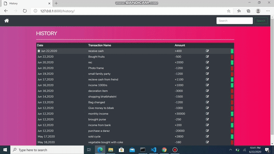

# Quick Start
1.Clone repo like this:
 <pre>git clone https://github.com/Aasess/ExpenseTracker.git</pre>

2.Create a virtualenv in cmd
<pre>python3 -m venv virtualenv</pre>

3.Activate virtualenv in cmd
<pre>virtualenv\Scripts\activate.bat</pre>

4.Install packages from requirements.txt file
<pre>pip install -r /path/to/requirements.txt</pre>

5.Change your TimeZone from settings.py(updated)

MyTimeZone is: <pre>TIME_ZONE = 'Asia/Kathmandu'</pre>

6.Run migrations as:
<pre>python manage.py makemigrations
python manage.py migrate</pre>

7.Start the development:
<pre>python manage.py runserver</pre>

8.visit http://127.0.0.1:8000/

# features
<li>Add new transaction</li>
<li>Edit transaction</li>
<li>Delete transaction</li>
<li>Read transaction</li>
<li>View graphical representation of current month income and expense using Bokeh</li>
<li>Prediction of next 10 days balance(income-expense) using LinearRegression</li>

# Demo
from starting to edit transaction

from delete transaction to prediction report

# for analysis
There is a notebook dir which contain ipynb file for actual LinearRegression model that is implemented in Django.
